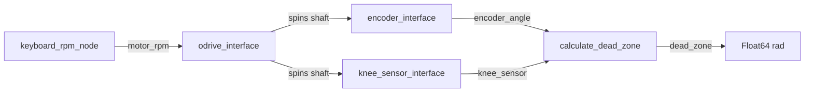

# Bench Test

Motor-driven bench to measure the **dead zone** (switching error) of a latching Hall sensor against a high-resolution shaft encoder.

An ODrive spins the shaft. An AS5047D encoder reports continuous angle. A PIC HS-3511 latching Hall reports ON/OFF edges. Comparing those edges to the encoder shows how far the Hall’s switch points drift from an ideal half-turn.

## Methodology

1. Command shaft speed (RPM) over CAN via the ODrive.
2. Stream shaft angle from the AS5047D (`encoder_angle`).
3. Publish Hall latch transitions (`knee_sensor`).
4. At each latch edge after the first, compute how far the measured travel differs from π radians and publish that on `dead_zone`.



## How dead zone is calculated

`calculate_dead_zone` keeps the latest encoder angle and watches Hall latch edges:

1. **Arm** on the first edge — store that angle and latch state.
2. On each later **ON↔OFF** transition, take the absolute shortest-arc angle between the previous and current encoder samples (handles wraparound via `atan2`).
3. Publish **dead zone** = that arc minus π:

   `dead_zone = shortest_arc(prev, current) − π`

An ideal bipolar latch switches every half-turn (π rad). Positive values mean the latch switched late (arc > π); negative means early (arc < π). Units are radians.

## Packages

| Package | Role |
| --- | --- |
| `odrive_interface` | SocketCAN velocity control of an ODrive Micro, plus a keyboard RPM prompt |
| `encoder_interface` | AS5047D over SPI → `encoder_angle`; `~/zero` service |
| `knee_sensor_interface` | HS-3511 GPIO edges → `knee_sensor`; also hosts `calculate_dead_zone` |
| `experiment_manager` | Automated RPM sweep; raw latch angles per arm → bag |

## Quick start

```bash
# From the workspace root (ROS 2 sourced)
colcon build
source install/setup.bash

ros2 launch knee_sensor_interface bench_test.launch.py
```

In another terminal (same workspace sourced):

```bash
ros2 topic echo /dead_zone
```

## Automated latch-angle experiment

Sweeps motor speed (6, then 10…80 RPM forward, settle at 0, then the same speeds reverse). At each speed, records the encoder angle when each Hall “arm” switches, drops the first sample after the speed change, then publishes the next 20 raw angles on `arm1_switch_angle` / `arm2_switch_angle`. A rosbag of `motor_rpm` and those topics is started with the launch.

```bash
ros2 launch experiment_manager experiment.launch.py
```

1. Align the shaft so arm 1 is at the reference pose.
2. Start the sweep (zeros the encoder, then runs):

```bash
ros2 service call /experiment_manager_node/start_experiment std_srvs/srv/Trigger {}
```

Bag output is written under the launch working directory as `latch_angle_experiment_<timestamp>/`.

Hardware defaults (CAN iface, SPI device, GPIO chip/line, topics) live in each node’s parameters; override with `ros2 param` or launch args as needed.

Get bags on local
```bash
rsync -avz benchtestpi@192.168.1.139:/home/benchtestpi/benchTest/latch_angle_experiment_20260807_163012 ./hallTest
```