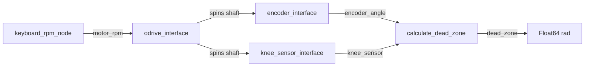

# Bench Test

Motor-driven bench to measure the **dead zone** (switching error) of a latching Hall sensor against a high-resolution shaft encoder.

An ODrive spins the shaft. An AS5047D encoder reports continuous angle. A PIC HS-3511 latching Hall reports ON/OFF edges. Comparing those edges to the encoder shows how far the Hall’s switch points drift from an ideal half-turn.

## Methodology

1. Command shaft speed (RPM) over CAN via the ODrive.
2. Stream shaft angle from the AS5047D (`encoder_angle`).
3. Publish Hall latch transitions (`knee_sensor`).
4. At each latch edge after the first, compute how far the measured travel differs from π radians and publish that on `dead_zone`.



## How dead zone is calculated

`calculate_dead_zone` keeps the latest encoder angle and watches Hall latch edges:

1. **Arm** on the first edge — store that angle and latch state.
2. On each later **ON↔OFF** transition, take the absolute shortest-arc angle between the previous and current encoder samples (handles wraparound via `atan2`).
3. Publish **dead zone** = that arc minus π:

   `dead_zone = shortest_arc(prev, current) − π`

An ideal bipolar latch switches every half-turn (π rad). Positive values mean the latch switched late (arc > π); negative means early (arc < π). Units are radians.

## Packages

| Package | Role |
| --- | --- |
| `odrive_interface` | SocketCAN velocity control of an ODrive Micro, plus a keyboard RPM prompt |
| `encoder_interface` | AS5047D over SPI → `encoder_angle` |
| `knee_sensor_interface` | HS-3511 GPIO edges → `knee_sensor`; also hosts `calculate_dead_zone` |

## Quick start

```bash
# From the workspace root (ROS 2 sourced)
colcon build
source install/setup.bash

ros2 launch knee_sensor_interface bench_test.launch.py
```

In another terminal (same workspace sourced):

```bash
ros2 topic echo /dead_zone
```

Hardware defaults (CAN iface, SPI device, GPIO chip/line, topics) live in each node’s parameters; override with `ros2 param` or launch args as needed.
